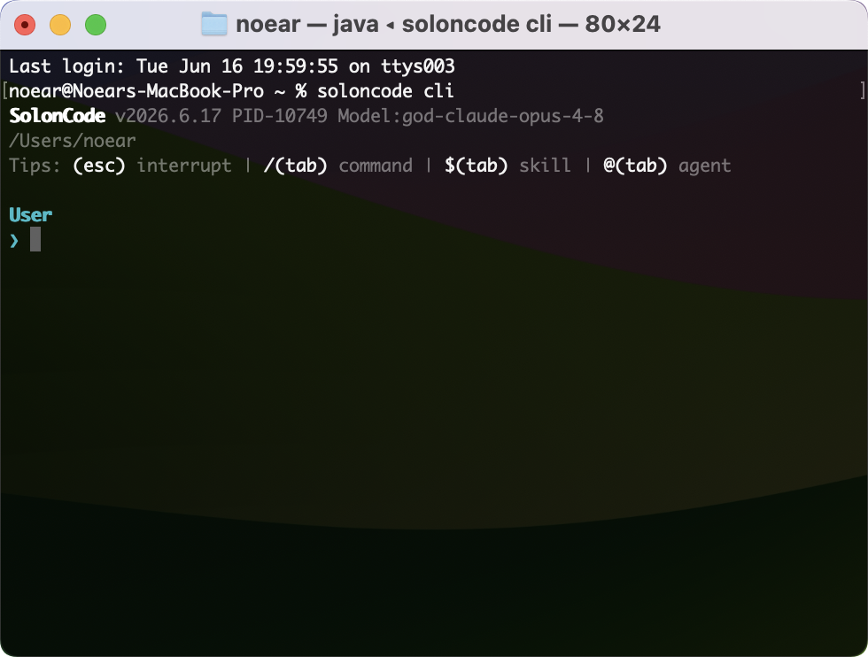

<div align="center">
<h1>SolonCode</h1>
<p>Otwartoźródłowy agent kodowania zbudowany na bazie <a href="https://github.com/opensolon/solon-ai">Solon AI</a> i Javy (obsługuje środowiska uruchomieniowe Java8 do Java26)</p>
<p>Najnowsza wersja: v2026.5.9</p>


</div>

<div align="center">

[中文](README.zh.md) | [日本語](README.ja.md) | [한국어](README.ko.md) | [Deutsch](README.de.md) | [Français](README.fr.md) | [Español](README.es.md) | [Italiano](README.it.md)

[Русский](README.ru.md) | [العربية](README.ar.md) | [Português (BR)](README.br.md) | [ไทย](README.th.md) | [Tiếng Việt](README.vi.md) | [Polski](README.pl.md)

[বাংলা](README.bn.md) | [Bosanski](README.bs.md) | [Dansk](README.da.md) | [Ελληνικά](README.gr.md) | [Norsk](README.no.md) | [Türkçe](README.tr.md) | [Українська](README.uk.md)

</div>

## Instalacja i konfiguracja

Instalacja:

```bash
# Mac / Linux:
curl -fsSL https://solon.noear.org/soloncode/setup.sh | bash

# Windows (PowerShell):
irm https://solon.noear.org/soloncode/setup.ps1 | iex
```

Konfiguracja (należy zmodyfikować po instalacji):

* Katalog instalacyjny: `~/soloncode/bin/`
* Znajdź plik konfiguracyjny `~/soloncode/config.yml` i zmodyfikuj konfigurację `models` (głównie)
* Opcje konfiguracji `models` znajdują się w: [Konfiguracja modelu i opcje żądania](https://solon.noear.org/article/1087)

## Uruchamianie

Uruchom polecenie `soloncode` z dowolnego katalogu w konsoli (czyli w swoim obszarze roboczym).

```bash
demo@MacBook-Pro ~ % soloncode
SolonCode v2026.5.9
/Users/noear
Tips: (esc) interrupt | /(tab) ls command | @(tab) ls agent

User
> 
```

Testowanie funkcji (wypróbuj następujące zadania, od prostych do złożonych):

* `你好`
* `用网络分析下 ai mcp 协议，然后生成个 ppt` // Zaleca się wcześniejsze zainstalowanie niektórych umiejętności
* `帮我设计一个 agent team（设计案存为 demo-dis.md），开发一个 solon + java17 的经典权限管理系统（demo-web），前端用 vue3，界面要简洁好看`


## Dokumentacja

Aby uzyskać więcej szczegółów dotyczących konfiguracji, odwiedź naszą [Oficjalną dokumentację](https://solon.noear.org/article/soloncode).

## Wkład

Jeśli jesteś zainteresowany wniesieniem wkładu w kod, przeczytaj [Dokumentację wkładu](https://solon.noear.org/article/623) przed przesłaniem PR.

## Tworzenie na bazie SolonCode

Jeśli używasz "soloncode" w nazwie swojego projektu (np. "soloncode-dashboard" lub "soloncode-app"), wskaż w pliku README, że projekt nie jest oficjalnie rozwijany przez zespół OpenSolon i nie jest z nim powiązany.

## Często zadawane pytania: Czym różni się od Claude Code?

Pod względem funkcjonalności są podobne, z kluczowymi różnicami:

* Zbudowany w Javie, w 100% otwarty kod źródłowy.
* W pełni sterowany i budowany przy użyciu promptów w języku chińskim
* Niezależny od dostawcy. Konfiguruj modele według potrzeb. Iteracja modeli będzie zmniejszać luki i obniżać koszty, co sprawia, że elastyczna konfiguracja jest ważna.
* Jednocześnie obsługuje interfejs wiersza poleceń terminala (CLI), interfejs przeglądarki (WEB) i interfejs IDE na pulpicie (Desktop).
* Obsługuje Web, protokół ACP do komunikacji zdalnej.