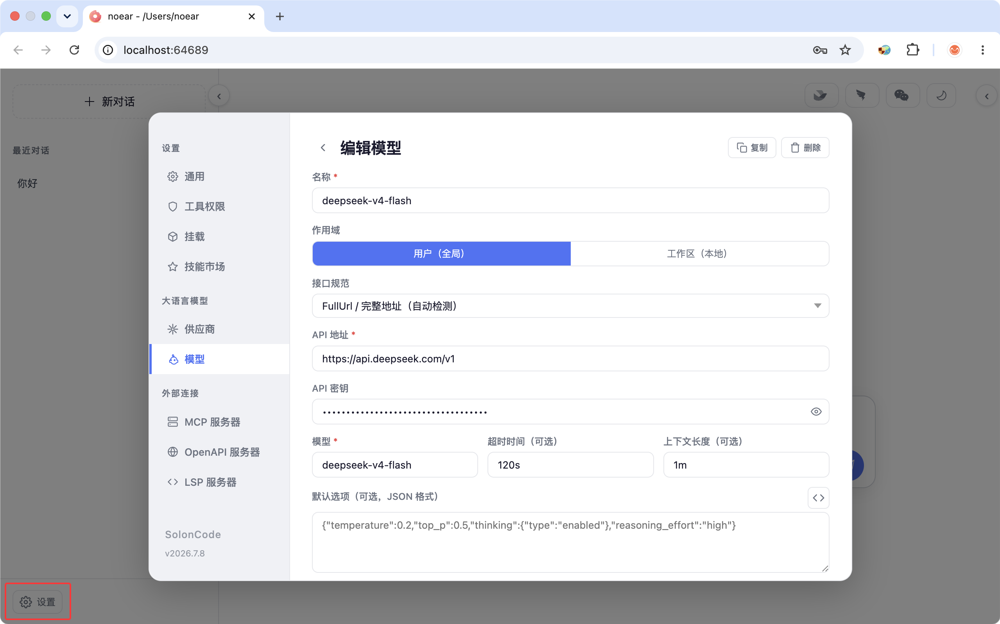

<div align="center">
<h1>SolonCode</h1>
<p>基于 <a href="https://github.com/opensolon/solon-ai">Solon AI</a> 与 Java 实现的开源编码智能体（支持 Java8 到 Java26 环境启动）</p>
<p>最新版本：v2026.7.21</p>


</div>

<div align="center">

[中文](README.zh.md) | [日本語](README.ja.md) | [한국어](README.ko.md) | [Deutsch](README.de.md) | [Français](README.fr.md) | [Español](README.es.md) | [Italiano](README.it.md)

[Русский](README.ru.md) | [العربية](README.ar.md) | [Português (BR)](README.br.md) | [ไทย](README.th.md) | [Tiếng Việt](README.vi.md) | [Polski](README.pl.md)

[বাংলা](README.bn.md) | [Bosanski](README.bs.md) | [Dansk](README.da.md) | [Ελληνικά](README.gr.md) | [Norsk](README.no.md) | [Türkçe](README.tr.md) | [Українська](README.uk.md)

</div>

## 安装与配置

安装：

```bash
# Mac / Linux / Harmony PC:
curl -fsSL https://solon.noear.org/soloncode/setup.sh | bash

# Windows (PowerShell):
irm https://solon.noear.org/soloncode/setup.ps1 | iex
```

修改配置（新用户推荐先用 Web 设置页配置：）：

```
soloncode web 0
```

进入页面后打开“设置 -> 大语言模型”，添加模型并测试连接。



## 运行

在控制台"任意"目录（即工作区）下，运行 `soloncode cli`（cli 交互）或者 `soloncode web 0`（web 交互） 命令即可。

* `soloncode`（cli 交互）

```bash
demo@MacBook-Pro ~ % soloncode cli
SolonCode v2026.7.21 PID-87950 Model:deepseek-v4-flash
/Users/demo
Tips: (esc) interrupt | /(tab) command | $(tab) skill | @(tab) agent

User
❯ 
```

* `soloncode web 0`（web 交互）

```bash
demo@MacBook-Pro ~ % soloncode web 0
SolonCode v2026.7.21 PID-73617 Model:deepseek-v4-flash
/Users/demo
2026-07-09 11:26
Web interface: http://localhost:50488/
```

效果测试（分别尝试以下任务，从简单到复杂）：

* `你好`
* `用网络分析下 ai mcp 协议，然后生成个 ppt` //最好提前安装些 skill
* `帮我设计一个 agent team（设计案存为 demo-dis.md），开发一个 solon + java17 的经典权限管理系统（demo-web），前端用 vue3，界面要简洁好看`


## 文档

更多配置说明请查看我们的 [官方文档](https://solon.noear.org/article/soloncode)。

## 参与贡献

如有兴趣贡献代码，请在提交 PR 前阅读 [贡献指南 (Contributing Docs)](https://solon.noear.org/article/623)。

## 基于 SolonCode 进行开发

如果你在项目名中使用了 "soloncode"（如 "soloncode-dashboard" 或 "soloncode-app"），请在 README 里注明该项目不是 OpenSolon 团队官方开发，且不存在隶属关系。

## 常见问题：和 Claude Code 有什么不同？

功能上很相似，关键差异：

* 采用 Java 实现，100% 开源。兼容毕昇 JDK（Huawei BiSheng JDK），兼容鸿蒙 PC（Huawei Harmony PC）。
* 纯中文提示词驱动与构建。
* 不绑定特定提供商。按需配置模型。模型迭代会缩小差异、降低成本，因此自由配置很重要。
* 同时支持终端命令行界面 (CLI)、浏览器界面（WEB）、桌面IDE界面（Desktop）。
* 支持 Web，ACP 协议进行远程通讯。